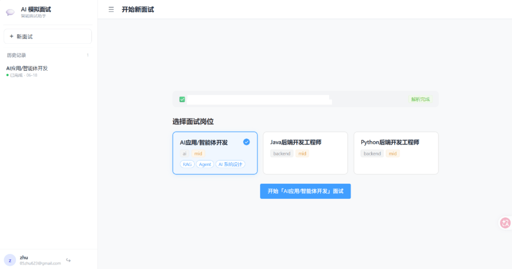
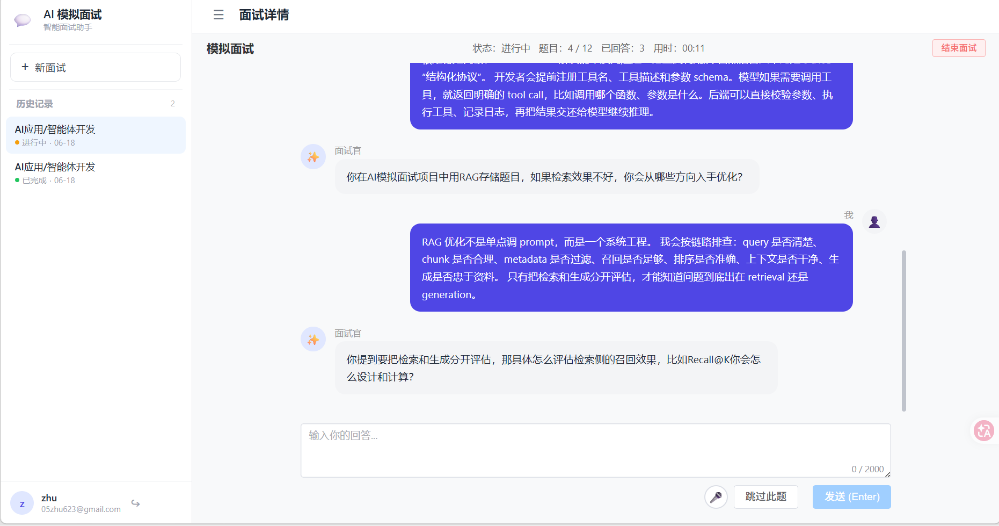
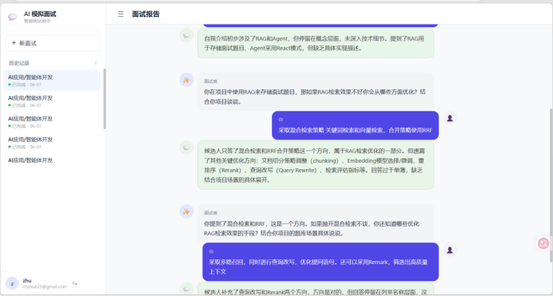
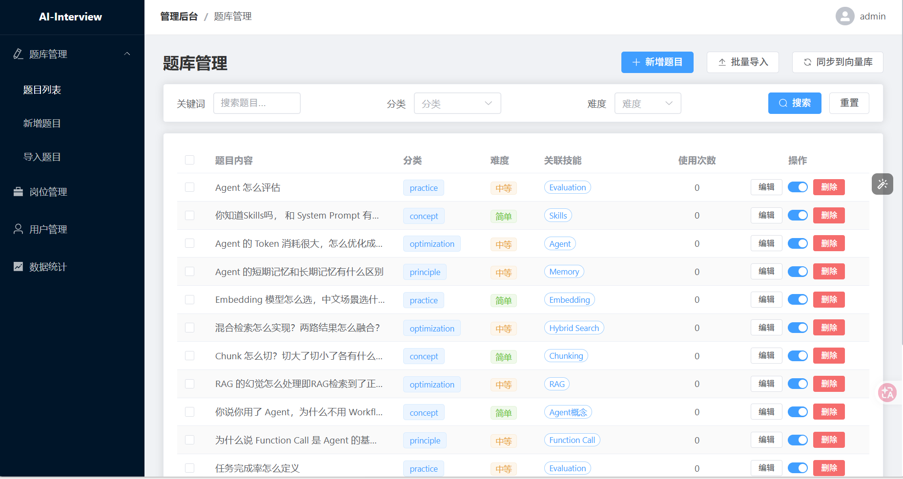
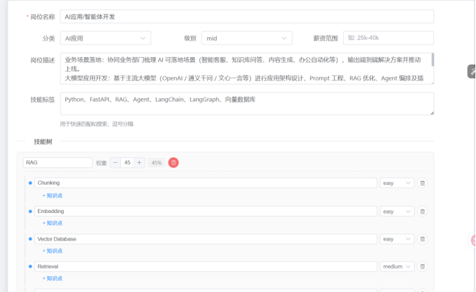

# AI-Interview

AI-Interview 是一个基于 LLM 智能体的模拟面试平台。它不是简单的固定题库问答系统，而是通过面试智能体结合候选人简历、目标岗位、历史回答和实时能力画像，动态检索题目、连续追问、评估回答，并在面试结束后生成结构化报告。

项目覆盖候选人端与管理端：候选人可以上传简历、选择岗位、进入 AI 面试房间并查看报告；管理员可以维护岗位、题库和用户数据，为不同岗位构建可持续迭代的面试内容体系。

> 项目状态：个人学习与作品集展示项目，当前重点展示智能体面试流程、RAG 动态出题、结构化输出隔离和前后端完整业务闭环。

## 项目展示

### 候选人端







### 管理端

<table>
  <tr>
    <td width="50%"></td>
    <td width="50%"></td>
  </tr>
  <tr>
    <td align="center">后台管理</td>
    <td align="center">岗位列表与新增岗位</td>
  </tr>
</table>

## 核心能力

- ReAct 面试智能体：通过 LangGraph ReAct 流程调度回答评估、RAG 出题、画像更新和面试结束决策。
- RAG 动态出题：面试过程中根据岗位、简历和候选人当前回答实时检索题库，而不是在创建面试时预选固定题目。
- 多轮追问策略：根据候选人的回答深度、技能掌握度和短板，决定继续追问、切换技能方向或结束面试。
- 结构化输出隔离：模型最终输出必须包含 `candidate_message`，后端只展示候选人可见内容，避免内部推理说明泄漏。
- 安全兜底链路：模型输出格式不合格时自动 retry，仍失败时优先从本轮 RAG 候选题中选择原题兜底。
- 实时能力画像：每轮回答都会更新候选人的技能掌握度、回答深度、风险点和整体印象。
- SSE 流式对话：面试官问题逐字推送，前端提供接近实时的 AI 面试体验。
- 报告异步生成：面试完成后异步汇总 Q&A、过程评价和能力画像，生成优点、不足与改进建议。
- 管理后台：支持岗位管理、题库维护、题目导入、用户管理和数据看板。

## 系统架构

```text
Frontend (Vue 3 + TypeScript + Element Plus)
      |
      | REST / SSE
      v
Backend (FastAPI)
      |
      |-- Auth / Resume / Job / Interview / Report APIs
      |-- Interview Agent (LangGraph ReAct)
      |-- RAG Search (Chroma + optional reranker)
      |-- Report Service
      |
      v
MySQL       Redis       Chroma
Users       Session     Question vectors
Resumes     Profile     Semantic search
Jobs        Locks
Messages
Reports
```

## 面试智能体流程

```text
Candidate Answer
      |
      v
Interview Agent (LangGraph ReAct)
      |
      |-- evaluate_answer
      |      评估回答，写入本轮评语和能力画像
      |
      |-- retrieve_questions
      |      根据追问意图从 Chroma 题库检索候选题
      |
      |-- update_profile
      |      更新候选人的技能掌握度、深度、短板
      |
      |-- end_interview
      |      结束面试并触发报告生成
      |
      v
Structured Output
      |
      |-- candidate_message  -> 返回前端
      |-- internal_note      -> 仅用于后端日志，不展示给候选人
      |
      v
SSE Stream -> Frontend
```

面试智能体位于 `backend/app/agent/interview_agent.py`，工具定义位于 `backend/app/agent/tools.py`。每一轮对话的主要流程如下：

1. 加载会话信息、简历摘要、岗位技能树、最近对话和候选人画像。
2. Agent 根据候选人回答调用 `evaluate_answer`，生成本轮评价并更新画像。
3. Agent 判断继续追问、切换技能方向或结束面试。
4. 若需要继续提问，调用 `retrieve_questions` 从 RAG 题库获取候选题。
5. Agent 以结构化 JSON 输出下一题，后端只读取 `candidate_message`。
6. 后端通过 SSE 将问题流式推送给前端，并保存为面试消息。

### Agent 工具

| Tool | 作用 |
| --- | --- |
| `evaluate_answer` | 对候选人回答进行点评，更新 confidence、depth、gaps 等能力画像字段 |
| `retrieve_questions` | 根据本轮追问意图检索题库，返回 3-5 道候选题，并过滤已问过的问题 |
| `update_profile` | 直接调整候选人画像，用于补充整体印象或技能判断 |
| `end_interview` | 结束面试，写入完成状态并触发报告生成 |

## RAG 出题机制

题目不是在创建面试时一次性固定生成，而是在面试过程中由 Agent 按需检索。

```text
Agent 追问意图
      |
      v
Embedding Query
      |
      v
Chroma Vector Search
      |
      v
Optional Reranker
      |
      v
Top Candidate Questions
      |
      v
Agent 选择并组织 candidate_message
```

主要特点：

- 题目原文、参考答案和评分点存储在 MySQL。
- 题目的语义索引存储在 Chroma。
- 检索输入来自 Agent 对当前回答的追问意图。
- 通过 `InterviewQuestionLink` 记录已问题目，避免同一场面试重复提问。
- 可选 reranker 对向量召回结果进行二次排序。
- 兜底问题优先来自本轮 RAG 候选题，保证问题仍然来自可维护题库。

## 结构化输出隔离

LLM 不能只靠提示词保证永远输出正确格式，因此后端增加了强约束解析和兜底链路。Agent 最终回复要求为 JSON：

```json
{
  "action": "ask_next",
  "candidate_message": "真正说给候选人的一句面试问题",
  "internal_note": "选题依据、选择了第几题、如何微调措辞等内部说明"
}
```

后端策略：

- 只展示 `candidate_message`。
- `internal_note` 不会返回前端，也不会保存为候选人可见对话。
- 若模型输出 Markdown、代码块或括号内内部说明，后端会清洗。
- 若 JSON 解析失败或 `candidate_message` 不合格，触发一次 retry。
- retry 仍不合格时，优先使用本轮 RAG 候选池中的第一道干净原题。
- 如果本轮没有 RAG 候选题，才使用通用项目追问作为最后兜底。

这条链路用于避免下面这类内容泄漏给候选人：

```text
（我选第0题微调措辞，结合他项目里提到的记忆系统设计来问）
```

## 候选人画像

系统会在面试过程中持续维护 `CandidateProfile`：

```json
{
  "skills": {
    "Backend/RAG/Evaluation": {
      "confidence": 0.6,
      "depth": 0.5,
      "comments": ["回答覆盖了召回率和命中率，但缺少负样本构造细节"],
      "gaps": ["缺少离线评估集构造经验"],
      "asked": 2
    }
  },
  "impression": "候选人有工程经验，但评估体系仍需追问",
  "current_target": "Backend/RAG/Evaluation"
}
```

当前画像保存在 Redis，设置 24 小时 TTL。它用于跨轮次指导追问方向，而不是把完整历史无限堆进 prompt。

## 技术栈

### 后端

| 模块 | 技术 |
| --- | --- |
| Web API | FastAPI + Uvicorn |
| Agent | LangGraph + LangChain |
| LLM | DeepSeek  API |
| ORM | SQLAlchemy Async |
| Migration | Alembic |
| Database | MySQL |
| Cache / Lock | Redis |
| Vector DB | Chroma |
| Embedding | Ollama bge-m3 |
| Rerank | FlagEmbedding / bge-reranker-v2-m3 |
| Auth | JWT + bcrypt |
| Test | pytest |


## 快速开始

### 环境要求

- Python 3.10+
- Node.js 18+
- MySQL 8.0
- Redis 7
- Ollama，并安装 `bge-m3`
- DeepSeek API Key

### 1. 克隆项目

```bash
git clone <your-repository-url>
cd AI-interview
```

### 2. 配置后端

```bash
cd backend
pip install -r requirements.txt

# 复制并填写配置
cp .env.example .env
```

需要重点填写的配置：

```env
DATABASE_URL=mysql+aiomysql://root:<password>@localhost:3306/ai_interview
DATABASE_URL_SYNC=mysql+pymysql://root:<password>@localhost:3306/ai_interview
REDIS_URL=redis://localhost:6379/0
DEEPSEEK_API_KEY=<your-deepseek-api-key>
SECRET_KEY=<your-secret-key>
JWT_SECRET_KEY=<your-jwt-secret-key>
```

### 3. 准备模型与数据

```bash
# 安装 embedding 模型
ollama pull bge-m3

# 执行数据库迁移
cd alembic
python -m alembic upgrade head
cd ..

# 初始化岗位数据
python manage.py seed-jobs
```

题库可以在管理后台导入或新增。题库准备完成后，同步向量索引：

```bash
python manage.py sync-questions
```

### 4. 启动后端

```bash
python -m uvicorn main:app --host 127.0.0.1 --port 8000 --reload
```

健康检查：

```text
GET http://localhost:8000/health
GET http://localhost:8000/ready
```

### 5. 启动前端

```bash
cd ../frontend
npm install
npm run dev
```

前端默认访问地址：

```text
http://localhost:5173
```

管理端单独开发服务：

```bash
npm run dev:admin
```

管理端默认访问地址：

```text
http://localhost:5174
```

## 常用命令

后端测试：

```bash
cd backend
python -m pytest
```

前端构建：

```bash
cd frontend
npm run build
```

管理端开发服务：

```bash
cd frontend
npm run dev:admin
```

管理端构建：

```bash
cd frontend
npm run build:admin
```

创建管理员账号：

```bash
cd backend
python manage.py create-admin -u admin -e admin@example.com -p your-password
```

## API 概览

| 模块 | 路径 | 说明 |
| --- | --- | --- |
| Auth | `/api/v1/auth/*` | 注册、登录、刷新 token、退出登录 |
| Resumes | `/api/v1/resumes/*` | 上传、解析、列表、鉴权下载 |
| Jobs | `/api/v1/jobs/*` | 岗位列表、详情、管理 |
| Interviews | `/api/v1/interviews/*` | 创建、开始、流式对话、跳过、结束、删除 |
| Reports | `/api/v1/reports/*` | 报告查询与生成状态 |
| Questions | `/api/v1/questions/*` | 管理员题库管理 |
| Admin | `/api/v1/admin/*` | 后台看板与用户管理 |

面试流式对话：

```text
POST /api/v1/interviews/{session_id}/chat/stream
```

主要 SSE 事件：

| Event | 说明 |
| --- | --- |
| `status` | 本轮处理状态 |
| `score` | 本轮回答评价，仅用于报告和画像，不展示给候选人 |
| `profile` | 候选人画像更新 |
| `token` | 面试官问题逐字流式输出 |
| `question` | 本轮问题结束，返回题目元数据 |
| `done` | 面试结束 |
| `error` | 可恢复错误或失败原因 |

## 数据模型

```text
User
  |-- Resume
  |-- InterviewSession
        |-- InterviewMessage
        |-- InterviewQuestionLink
        |-- ScoreReport

JobPosition
  |-- InterviewSession

Question
  |-- InterviewQuestionLink
```

核心表：

- `users`：用户与管理员账号。
- `resumes`：简历文件和解析结果。
- `job_positions`：岗位、技能树和岗位要求。
- `questions`：题库原题、参考答案、评分点。
- `interview_sessions`：面试会话、状态、进度和报告生成状态。
- `interview_messages`：面试官和候选人的完整对话。
- `interview_question_links`：单场面试已使用题目。
- `score_reports`：面试报告。

## 项目结构

```text
backend/
  app/
    agent/
      interview_agent.py   # 面试智能体主流程
      tools.py             # ReAct 工具定义
      rag.py               # RAG 检索
      prompts.py           # 智能体提示词
      report.py            # 报告内容编排
    api/v1/                # REST API
    core/                  # 配置、数据库、Redis、LLM、健康检查、日志
    models/                # SQLAlchemy 模型
    schemas/               # Pydantic Schema
    services/              # 业务服务
  alembic/                 # 数据库迁移
  eval/rag/                # RAG 评估工具
  tests/                   # pytest 测试

frontend/
  src/
    views/user/            # 候选人端页面
    views/admin/           # 管理端页面
    api/                   # API 请求封装
    stores/                # Pinia 状态管理
    components/            # 公共组件

docs/
  images/                  # README 展示图片
```

## 上线前说明

- 请勿提交 `.env`、上传的简历文件、Chroma 本地数据、数据库 dump、`node_modules` 或构建产物。
- README 中的截图建议使用脱敏数据，避免暴露真实邮箱、手机号、简历内容、API Key 或后台账号。
- 生产环境建议将 MySQL、Redis、Chroma 数据目录、文件上传目录和日志目录统一纳入备份与监控。
- DeepSeek API Key、JWT 密钥、SMTP 授权码等敏感配置应通过服务器环境变量或密钥管理服务注入。
- 若部署在反向代理后，需要关闭 SSE 响应缓冲，保证面试流式输出能够实时返回。

## License

This project is currently intended for learning and portfolio demonstration. Please add a formal open-source license before public reuse, redistribution, or commercial use.
