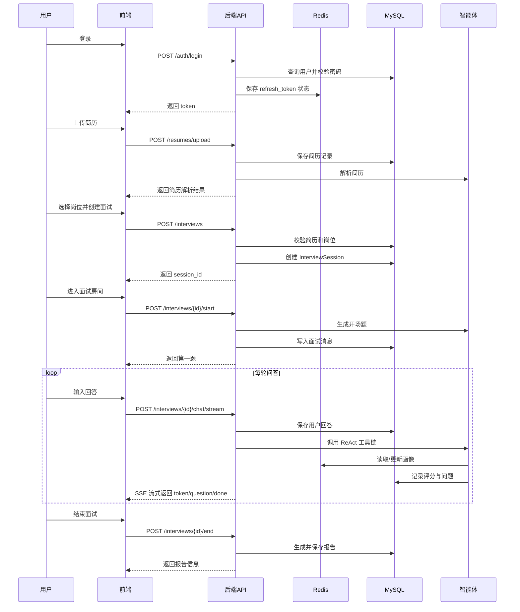

# AI-Interview 项目阅读笔记

这份文档用新手视角，一步一步解释 AI-Interview 项目的结构、请求流程和关键设计。

## 第 1 步：先看项目入口

这个项目有两个主要入口：

- 后端入口：`backend/main.py`
- 前端入口：`frontend/src/main.ts`

后端入口里会创建 FastAPI 应用：

```python
app = FastAPI(...)
```

你可以把它理解成：创建一个后端服务器。

`backend/main.py` 主要做了这些事：

1. 创建 FastAPI 应用。
2. 配置 CORS，让前端可以请求后端。
3. 挂载上传文件目录。
4. 注册各个 API 路由。
5. 提供健康检查接口。

其中最重要的是路由注册：

```python
app.include_router(auth.router, prefix="/api/v1/auth", tags=["Auth"])
app.include_router(resumes.router, prefix="/api/v1/resumes", tags=["Resumes"])
app.include_router(jobs.router, prefix="/api/v1/jobs", tags=["Jobs"])
app.include_router(interviews.router, prefix="/api/v1/interviews", tags=["Interviews"])
app.include_router(reports.router, prefix="/api/v1/reports", tags=["Reports"])
```

意思是：

| 路径前缀 | 功能 |
| --- | --- |
| `/api/v1/auth` | 登录、注册、刷新 token |
| `/api/v1/resumes` | 简历上传、列表、详情、重新解析 |
| `/api/v1/jobs` | 岗位相关功能 |
| `/api/v1/interviews` | 创建面试、开始面试、聊天、结束面试 |
| `/api/v1/reports` | 面试报告 |

一次请求的大致流程：

```text
浏览器发起请求
-> 进入 backend/main.py 创建的 FastAPI 应用
-> 根据路径前缀分发到对应 router
-> router 里的接口函数执行具体业务逻辑
-> 查询数据库 / 访问 Redis / 调用 AI 服务
-> 返回 JSON 给前端
```

这一节要记住：

```text
main.py 是后端大门。
它不负责具体业务，而是负责创建应用、配置中间件、挂载路由。
```

## 第 2 步：登录流程

登录页面在：

```text
frontend/src/views/user/LoginView.vue
```

用户点击登录按钮后，会执行：

```ts
async function handleSubmit() {
  if (!validate()) return

  if (isLogin.value) {
    await authStore.login(form.email, form.password)
    router.push(...)
  }
}
```

关键是这一行：

```ts
await authStore.login(form.email, form.password)
```

`authStore` 是前端的登录状态仓库，用来保存当前用户和 token。

它在：

```text
frontend/src/stores/auth.ts
```

登录逻辑：

```ts
async function login(email: string, password: string) {
  const res = await authApi.login({ email, password })
  const d = res.data.data
  setAuth({
    access_token: d.tokens.access_token,
    refresh_token: d.tokens.refresh_token,
    user: d.user,
  })
}
```

然后 `authApi.login` 在：

```text
frontend/src/api/auth.ts
```

```ts
login(data: { email: string; password: string }) {
  return apiClient.post('/auth/login', data)
}
```

`apiClient` 在：

```text
frontend/src/api/client.ts
```

```ts
const apiClient = axios.create({
  baseURL: '/api/v1',
  timeout: 120000,
  headers: { 'Content-Type': 'application/json' },
})
```

所以前端这句：

```ts
apiClient.post('/auth/login')
```

最终会变成：

```http
POST /api/v1/auth/login
```

后端登录接口在：

```text
backend/app/api/v1/auth.py
```

```python
@router.post("/login")
async def login(
    data: UserLogin,
    db: AsyncSession = Depends(get_db),
    redis: Redis = Depends(get_redis),
):
```

因为 `main.py` 里给这个 router 加了前缀：

```python
prefix="/api/v1/auth"
```

所以最终路径就是：

```http
POST /api/v1/auth/login
```

登录完整链路：

```text
LoginView.vue 表单
-> authStore.login
-> authApi.login
-> apiClient.post('/auth/login')
-> POST /api/v1/auth/login
-> 后端查询 users 表
-> 后端校验密码
-> 后端返回 access_token 和 refresh_token
-> 前端保存 token
```

## 第 3 步：`Depends` 是什么

在 FastAPI 里，`Depends` 是依赖注入。

简单理解：

```text
接口函数需要什么公共资源，就让 FastAPI 自动帮你准备。
```

比如登录接口：

```python
async def login(
    data: UserLogin,
    db: AsyncSession = Depends(get_db),
    redis: Redis = Depends(get_redis),
):
```

意思是：

- `data` 来自请求体。
- `db` 通过调用 `get_db` 得到。
- `redis` 通过调用 `get_redis` 得到。

所以：

```python
db: AsyncSession = Depends(get_db)
```

可以理解成：

```text
运行这个接口前，请给我准备一个数据库 session。
```

而：

```python
redis: Redis = Depends(get_redis)
```

可以理解成：

```text
运行这个接口前，请给我准备一个 Redis 客户端。
```

为什么要用 `Depends`？

1. 公共逻辑可以复用。
2. 数据库 session 可以统一打开、提交、回滚、关闭。
3. 写测试时可以把真实依赖替换成假的依赖。
4. 接口函数可以更专注于业务逻辑。

常见例子：

```python
Depends(get_db)
```

表示给接口提供数据库 session。

```python
Depends(get_redis)
```

表示给接口提供 Redis 客户端。

```python
Depends(get_current_user)
```

表示先验证 token，然后把当前登录用户传给接口。

## 第 4 步：数据库 session 是什么

在这个项目里，`session` 经常指 SQLAlchemy 的数据库会话。

比如：

```python
db: AsyncSession = Depends(get_db)
```

这个 `db` 就是数据库 session。

你可以把数据库 session 理解成：

```text
后端和数据库之间的一次工作上下文。
```

它可以做：

- 查询数据
- 新增数据
- 修改数据
- 删除数据
- 提交事务
- 回滚事务
- 关闭连接

数据库依赖在：

```text
backend/app/core/database.py
```

```python
async def get_db() -> AsyncSession:
    async with async_session_factory() as session:
        try:
            yield session
            await session.commit()
        except Exception:
            await session.rollback()
            raise
        finally:
            await session.close()
```

生命周期是：

```text
请求进来
-> 创建数据库 session
-> 把 session 交给接口函数
-> 如果接口成功，commit 提交
-> 如果接口失败，rollback 回滚
-> 最后 close 关闭
```

注意不要混淆：

```text
AsyncSession = 数据库操作上下文
InterviewSession = 一场面试的业务记录
```

两个都叫 session，但意思不同。

## 第 5 步：schema 和 model 的区别

新手读后端项目时，很容易把 `schema` 和 `model` 混在一起。

简单口诀：

```text
schema 管接口进出
model 管数据库存储
router 管业务流程
```

### schema 是什么

schema 在：

```text
backend/app/schemas
```

比如：

```python
class UserLogin(BaseModel):
    email: EmailStr
    password: str
```

它规定登录请求体必须长这样：

```json
{
  "email": "test@example.com",
  "password": "12345678"
}
```

schema 会在业务逻辑执行前校验数据。

比如：

```python
email: EmailStr
```

表示邮箱必须符合邮箱格式。

schema 的职责：

- 校验前端传来的数据。
- 定义后端返回给前端的数据格式。
- 避免把数据库里的敏感字段暴露给前端。

### model 是什么

model 在：

```text
backend/app/models
```

比如：

```python
class User(Base):
    __tablename__ = "users"

    id = ...
    username = ...
    email = ...
    password_hash = ...
    is_active = ...
    is_admin = ...
```

它代表数据库里的 `users` 表。

model 的职责：

- 定义表名。
- 定义字段。
- 定义字段类型。
- 定义索引和唯一约束。
- 定义表之间的关系。

### 为什么要分开

因为接口数据和数据库数据不是一回事。

登录请求是：

```json
{
  "email": "a@b.com",
  "password": "12345678"
}
```

数据库用户记录是：

```text
id
username
email
password_hash
is_active
is_admin
created_at
updated_at
```

数据库里存的是 `password_hash`，不是明文 `password`。

返回用户数据时，项目使用：

```python
UserOut.model_validate(user)
```

`UserOut` 只返回安全字段：

```python
class UserOut(BaseModel):
    id: str
    username: str
    email: str
    is_admin: bool
    avatar_url: str | None = None
    created_at: datetime
```

它不会返回 `password_hash`。

这一节要记住：

```text
前端请求数据 -> schema
数据库表结构 -> model
接口处理流程 -> router
```

## 第 6 步：注册流程和数据库写入

注册接口在：

```text
backend/app/api/v1/auth.py
```

```python
@router.post("/register", status_code=status.HTTP_201_CREATED)
async def register(
    data: RegisterRequest,
    db: AsyncSession = Depends(get_db),
    redis: Redis = Depends(get_redis),
):
```

请求数据由 `RegisterRequest` 校验：

```python
class RegisterRequest(BaseModel):
    username: str = Field(..., min_length=3, max_length=50, pattern=r"^[a-zA-Z0-9_]+$")
    email: EmailStr
    password: str = Field(..., min_length=8, max_length=128)
    code: str = Field(..., min_length=6, max_length=6, pattern=r"^\d{6}$")
```

请求体应该类似：

```json
{
  "username": "tom",
  "email": "tom@example.com",
  "password": "12345678",
  "code": "123456"
}
```

注册流程：

1. 用 `RegisterRequest` 校验请求数据。
2. 从 Redis 读取邮箱验证码。
3. 检查用户名是否重复。
4. 检查邮箱是否重复。
5. 创建 `User` 数据库 model。
6. 把它加入数据库 session。
7. 执行 `flush` 和 `refresh`。
8. 由 `get_db` 统一 commit。
9. 用 `UserOut` 返回安全的用户数据。

### Redis 验证码

```python
stored_code = await redis.get(f"email_code:{data.email}")
if not stored_code or stored_code != data.code:
    raise HTTPException(status_code=400, detail="验证码错误")
```

验证码是临时数据，所以放 Redis。

### 检查重复

```python
result = await db.execute(select(User).where(User.username == data.username))
if result.scalar_one_or_none():
    raise HTTPException(status_code=409, detail="用户名已存在")
```

这会查询 `users` 表，确认用户名没有被使用。

### 创建 User model

```python
user = User(
    username=data.username,
    email=data.email,
    password_hash=hash_password(data.password),
)
```

这里不会保存明文密码。

项目保存的是：

```python
password_hash
```

### 数据库写入方法

```python
db.add(user)
```

意思是：

```text
准备新增这个用户。
```

```python
await db.flush()
```

意思是：

```text
把 SQL 发送给数据库，但还没有最终提交事务。
```

```python
await db.refresh(user)
```

意思是：

```text
从数据库重新读取这个对象，让数据库生成的字段同步回来。
```

最终提交发生在 `get_db` 里：

```python
await session.commit()
```

如果中途出错，会执行：

```python
await session.rollback()
```

这一节要记住：

```text
db.add() = 准备新增
db.flush() = 发送 SQL，但不是最终提交
db.refresh() = 重新读取数据库生成字段
commit() = 最终保存
rollback() = 出错撤销
```

## 第 7 步：token 鉴权

登录成功后，后端会返回两个 token：

```text
access_token
refresh_token
```

简单理解：

```text
access_token = 访问接口用的短期通行证
refresh_token = 用来换新 access_token 的长期凭证
```

### 后端生成 token

在 `backend/app/api/v1/auth.py`：

```python
access_token = create_access_token(subject=user.id)
refresh_token = create_refresh_token(subject=user.id)
```

`subject=user.id` 表示：

```text
这个 token 属于这个用户。
```

### 前端保存 token

在 `frontend/src/stores/auth.ts`：

```ts
localStorage.setItem(STORAGE_KEYS.accessToken, access)
localStorage.setItem(STORAGE_KEYS.refreshToken, refresh)
```

浏览器会保存：

```text
access_token
refresh_token
auth_user
```

### 前端自动携带 token

在 `frontend/src/api/client.ts`：

```ts
apiClient.interceptors.request.use((config) => {
  const token = localStorage.getItem('access_token')
  if (token && config.headers) {
    config.headers.Authorization = `Bearer ${token}`
  }
  return config
})
```

所以请求会带上：

```http
Authorization: Bearer <access_token>
```

### 后端验证 token

需要登录的接口会写：

```python
current_user: User = Depends(get_current_user)
```

`get_current_user` 会读取请求头里的 `Authorization`，解析 token，检查是否合法，然后返回当前用户。

逻辑在：

```text
backend/app/api/deps.py
```

它会检查：

- token 是否存在。
- token 是否能解析。
- token 类型是不是 `access`。
- token 是否被拉黑。
- 用户是否存在。
- 用户是否启用。

### refresh_token 刷新机制

当 `access_token` 过期时，前端会收到 `401`。

然后 `frontend/src/api/client.ts` 会尝试：

```ts
axios.post('/api/v1/auth/refresh', {
  refresh_token: refreshToken,
})
```

如果刷新成功：

1. 保存新的 `access_token`。
2. 保存新的 `refresh_token`。
3. 重试刚才失败的请求。

### 为什么 Redis 要保存 refresh token

JWT 本身是无状态的，但 refresh token 需要可以撤销。

所以后端会把 refresh token 的编号存进 Redis：

```python
await redis.setex(
    f"refresh_token:{jti}",
    7 * 24 * 3600,
    user.id
)
```

刷新 token 时，后端会检查 Redis。  
如果 Redis 里没有这个编号，说明 refresh token 已失效。

这一节要记住：

```text
access_token 证明用户已登录。
refresh_token 用来换新的 access_token。
Authorization: Bearer xxx 是前端把 token 交给后端的方式。
get_current_user 负责验证 token 并查出当前用户。
Redis 让 refresh token 可以撤销和过期。
```

## 第 8 步：简历上传流程

上传接口在：

```text
backend/app/api/v1/resumes.py
```

```python
@router.post("/upload", status_code=201)
async def upload_resume(
    file: UploadFile = File(...),
    auto_parse: bool = Form(default=True),
    current_user: User = Depends(get_current_user),
    db: AsyncSession = Depends(get_db),
):
```

最终路径是：

```http
POST /api/v1/resumes/upload
```

### 为什么必须登录

这一行要求先登录：

```python
current_user: User = Depends(get_current_user)
```

如果 token 无效，接口不会继续执行。

如果 token 有效，`current_user` 就是当前登录用户。

创建简历记录时：

```python
user_id=current_user.id
```

这表示这份简历属于当前用户。

### 文件上传

```python
file: UploadFile = File(...)
```

表示这个接口接收上传文件。

前端发送的是 `multipart/form-data`，不是普通 JSON。

### 文件类型校验

```python
ALLOWED_TYPES = {
    "application/pdf": "pdf",
    "application/vnd.openxmlformats-officedocument.wordprocessingml.document": "docx",
}
```

只允许 PDF 和 DOCX。

当前代码检查：

```python
if file.content_type not in ALLOWED_TYPES:
    raise HTTPException(status_code=400, detail="不支持的文件类型")
```

这对 demo 来说方便，但真实项目不能只信 `content_type`，还应该校验文件真实内容。

### 文件大小校验

```python
content = await file.read()
if len(content) > MAX_SIZE:
    raise HTTPException(status_code=400, detail="文件过大")
```

### 保存文件

```python
file_ext = ALLOWED_TYPES[file.content_type]
filename = f"{uuid.uuid4()}.{file_ext}"
file_path = os.path.join(settings.UPLOAD_DIR, filename)

with open(file_path, "wb") as f:
    f.write(content)
```

项目用 UUID 文件名，而不是用户上传的原始文件名。

好处是：

```text
避免文件名冲突
避免用户文件名里包含危险字符
```

### 提取简历文本

```python
raw_text = await asyncio.to_thread(_extract_text, file_path, file_ext)
```

`_extract_text` 负责解析 PDF 或 DOCX。

PDF 使用 `pdfplumber`。

DOCX 使用 `python-docx`。

`asyncio.to_thread` 的作用是：  
把阻塞的文件解析任务放到单独线程里执行，避免卡住 async 后端服务。

### 创建 Resume 记录

```python
resume = Resume(
    user_id=current_user.id,
    original_filename=file.filename or "unknown",
    file_path=file_path,
    file_type=file_ext,
    file_size=len(content),
    raw_text=raw_text,
    parse_status="processing",
)
db.add(resume)
await db.flush()
await db.refresh(resume)
```

数据库会保存：

- 简历属于哪个用户
- 原始文件名
- 文件保存路径
- 文件类型
- 文件大小
- 提取出来的文本
- 解析状态

### AI 解析

如果 `auto_parse=True`：

```python
parsed = await parse_resume(raw_text)
resume.parsed_data = parsed
resume.parse_status = "completed"
```

如果解析失败：

```python
resume.parse_status = "failed"
resume.parse_error = str(exc)[:500]
```

所以解析状态可能是：

```text
processing
completed
failed
```

上传流程：

```text
前端选择 PDF/DOCX
-> POST /api/v1/resumes/upload
-> get_current_user 验证 token
-> 校验文件类型和大小
-> 保存文件到 uploads
-> 提取 raw_text
-> 创建 Resume 数据库记录
-> 如果 auto_parse 为 true，调用 AI 解析
-> 保存 parsed_data 和 parse_status
-> 返回 ResumeOut
```

这一节要记住：

```text
简历上传是一条完整业务链路：
鉴权 -> 校验 -> 保存文件 -> 提取文本 -> 写数据库 -> AI 解析 -> 返回结果
```

## 第 9 步：简历的数据隔离

用户私有数据必须隔离。

用户 A 不能看到、删除、重新解析用户 B 的简历。

这个项目靠两条规则实现：

```text
1. 通过 token 拿到 current_user。
2. 查询私有数据时，一定加 user_id == current_user.id。
```

### 查询简历列表

在 `backend/app/api/v1/resumes.py`：

```python
query = select(Resume).where(Resume.user_id == current_user.id)
count_query = select(func.count(Resume.id)).where(Resume.user_id == current_user.id)
```

意思类似：

```sql
SELECT * FROM resumes WHERE user_id = 当前用户ID;
```

所以用户只能看到自己的简历。

### 查询单个简历详情

```python
result = await db.execute(
    select(Resume).where(Resume.id == resume_id, Resume.user_id == current_user.id)
)
resume = result.scalar_one_or_none()
```

这里有两个条件：

```text
Resume.id == resume_id
Resume.user_id == current_user.id
```

意思是：

```text
查找这份简历，并且这份简历必须属于当前用户。
```

即使别人猜到了简历 ID，也查不到，因为 `user_id` 对不上。

### 删除简历

删除时同样会用：

```python
select(Resume).where(Resume.id == resume_id, Resume.user_id == current_user.id)
```

只有简历所有者能删除。

### 重新解析简历

重新解析也会做同样的归属检查。

这一节要记住：

```text
对于用户私有数据：

current_user: User = Depends(get_current_user)
+
Model.user_id == current_user.id
```

这个模式也会出现在面试记录、报告等用户私有数据里。

最重要的规则：

```text
不要相信前端传来的 user_id。
用户身份必须从 token 里解析出来。
```

## 第 10 步：创建面试流程

创建面试接口在：

```text
backend/app/api/v1/interviews.py
```

接口路径是：

```http
POST /api/v1/interviews
```

当前代码的作用是创建一条 `InterviewSession` 记录，也就是创建一场面试会话。

创建面试大致流程：

```text
前端传 resume_id、岗位信息、config
-> get_current_user 验证当前用户
-> 查询简历，并确认简历属于当前用户
-> 查询或创建岗位
-> 创建 InterviewSession
-> 尝试预选题目
-> 返回 session_id 给前端
```

`InterviewSession` 代表一场面试，里面会记录：

```text
user_id          这场面试属于哪个用户
resume_id        使用哪份简历
job_id           面试哪个岗位
status           当前状态
config           面试配置
current_question 当前问到第几题
started_at       开始时间
completed_at     结束时间
```

但是这里有旧逻辑残留，需要后续清理：

```text
1. 前端已经改成选择数据库里的岗位，但后端仍然用 job_title 查找/创建岗位。
2. 当前面试结束应由智能体控制，question_count / total_questions 不应再作为业务结束条件。
3. 当前应该由智能体边问边检索题目，不应该在创建面试时预选题。
```

新的设计应该是：

```text
前端传 resume_id + job_id
-> 后端确认简历属于当前用户
-> 后端确认岗位存在且启用
-> 创建 InterviewSession
-> 不自动创建岗位
-> 不预选题
-> 不依赖固定题目总数结束
```

这一节要记住：

```text
创建面试 = 创建一张面试会话单。
它应该只做会话初始化，不应该掺太多出题逻辑。
```

## 第 11 步：开始面试流程

开始面试接口是：

```http
POST /api/v1/interviews/{session_id}/start
```

前端在进入面试房间时调用它：

```text
frontend/src/views/user/InterviewRoomView.vue
```

页面挂载时会执行：

```ts
onMounted(() => {
  localStorage.setItem('active_interview', sessionId)
  startInterview()
})
```

后端开始面试的流程：

```text
根据 session_id 查询面试
-> 确认这场面试属于当前用户
-> 如果已 completed，则拒绝开始
-> 如果已 in_progress，则返回 resume=True，让前端加载历史消息
-> 如果是 created，则改为 in_progress
-> 写入 started_at
-> 写入一条 system message：面试已开始
-> 调用 InterviewManager 生成第一句话/第一题
-> 返回 first_question 给前端
```

核心状态变化：

```text
created -> in_progress
```

`InterviewManager.process_turn(session)` 会基于：

```text
简历
岗位
历史消息
候选人画像
岗位技能树
```

生成面试官的开场问题。

当前代码里有一个设计味道：

```text
start 接口是普通 JSON 接口，但内部复用了 SSE 生成器 process_turn，
然后从 SSE 字符串里解析 question 事件。
```

这能运行，但后续更清晰的设计应该是：

```text
智能体生成结果逻辑
和
SSE 事件包装逻辑
分开。
```

这一节要记住：

```text
创建面试只是创建记录。
开始面试才会把状态改成 in_progress，并生成第一句话。
```

## 第 12 步：SSE 面试对话流程

用户回答问题后，前端调用：

```http
POST /api/v1/interviews/{session_id}/chat/stream
```

这个接口不是普通 JSON 返回，而是 SSE 流式返回。

普通接口：

```text
请求 -> 后端处理完 -> 一次性返回 JSON
```

SSE 接口：

```text
请求 -> 后端边处理边返回事件 -> 前端边接收边显示
```

前端发送回答的位置：

```text
frontend/src/views/user/InterviewRoomView.vue
```

前端会用 `fetch` 请求流式接口：

```ts
fetch(`/api/v1/interviews/${sessionId}/chat/stream`, {
  method: 'POST',
  headers: {
    Authorization: `Bearer ${token}`,
    'Content-Type': 'application/json',
  },
  body: JSON.stringify({ message: text }),
})
```

后端处理流程：

```text
验证 token
-> 查询面试，并确认属于当前用户
-> 确认面试状态是 in_progress
-> 保存用户回答到 InterviewMessage
-> 创建 InterviewManager
-> 调用 process_turn
-> 返回 StreamingResponse
```

`process_turn` 是智能体一轮对话的调度器。

它主要做：

```text
读取简历
读取岗位
读取历史消息
读取 Redis 里的候选人画像
构造 ReAct prompt
创建 ReAct Agent
调用 LLM 和工具
保存画像
流式发送面试官输出
保存 AI 问题
必要时结束面试
```

SSE 事件大致有：

```text
status       面试官开始思考
action       智能体调用了某个工具
observation  工具返回结果
score        本轮评分结果
profile      候选人画像更新
token        面试官逐字输出
question     完整问题生成完毕
done         面试结束
error        处理失败
```

前端收到 `token` 时，会把内容一个字一个字拼到聊天框里。  
收到 `question` 时，说明本轮问题已经完整生成。  
收到 `done` 时，说明智能体决定面试结束，前端跳转报告页。

这一节要记住：

```text
/chat/stream 是整个面试流程的核心接口。
它负责把用户回答交给智能体，并通过 SSE 把面试官输出流式推回前端。
```

核心分工：

```text
前端：展示消息、接收 SSE、发送用户回答
后端接口：鉴权、保存用户回答、返回流式响应
InterviewManager：组织一轮智能体处理
ReAct Agent：判断、调用工具、生成下一问或结束面试
Redis：保存临时候选人画像
MySQL：保存持久面试消息、会话、报告
```

## 第 13 步：智能体工具 `tools.py`

智能体工具在：

```text
backend/app/agent/tools.py
```

前面讲过：

```text
InterviewManager = 调度一轮面试
```

但真正让智能体能“做事”的，是 `tools.py` 里的工具。

它提供了四个核心能力：

```text
evaluate_answer     点评候选人回答，并更新画像
retrieve_questions  从题库实时检索候选题
update_profile      直接调整候选人画像
end_interview       结束面试并生成报告
```

### CandidateProfile

`CandidateProfile` 表示候选人画像。

它记录：

```text
skills          各技能点掌握情况
impression      整体印象
current_target  当前考察目标
```

每个技能点里会有：

```text
confidence  置信度
depth       深度
comments    点评
gaps        知识盲区
asked       已问次数
```

候选人画像的作用是：

```text
让面试不是一问一答，而是逐步构建能力判断。
```

### ReactContext

`ReactContext` 是一轮智能体运行时的共享上下文。

它保存：

```text
db              数据库 session
session         当前面试会话
profile         当前候选人画像
search_results  本轮检索出的候选题
evaluation      本轮评分
is_ended        是否结束面试
report_id       报告 ID
```

可以理解成：

```text
ReactContext = 工具之间共享的临时工作台。
```

### evaluate_answer

作用：

```text
评价用户本轮回答，并更新画像。
```

它会把评分结果写到：

```text
ctx.evaluation
ctx.profile
用户回答消息的 extra_data
```

### retrieve_questions

作用：

```text
根据智能体想追问的方向，从题库检索候选题。
```

它内部调用：

```text
search_questions
```

也就是 RAG 检索。

它会过滤本场面试已经问过的题，避免重复提问。

这符合当前的新设计：

```text
题目不应该在创建面试时预选，
而应该由智能体在对话过程中实时检索。
```

### update_profile

作用：

```text
不绑定某一轮回答，直接修正候选人画像。
```

### end_interview

作用：

```text
把面试状态改成 completed，并尝试生成报告。
```

当它设置：

```text
ctx.is_ended = True
```

`InterviewManager` 就会向前端发送 `done` 事件。

### prompts.py 的作用

智能体规则在：

```text
backend/app/agent/prompts.py
```

`REACT_SYSTEM_PROMPT` 会告诉智能体：

```text
先评价回答
再判断追问、切换技能、结束面试
需要提问时调用 retrieve_questions
只能从候选题池里选题
不要自己编题
每次只问一个问题
```

这一节要记住：

```text
prompts.py = 规则说明书
tools.py = 智能体工具箱
interview_agent.py = 一轮面试调度器
```

## 第 14 步：RAG 题库检索

RAG 代码在：

```text
backend/app/agent/rag.py
```

RAG 的作用是：

```text
根据智能体想追问的方向，从题库里按语义找相关题目。
```

### MySQL 和 Chroma 的分工

题库主数据在 MySQL。

Chroma 是向量数据库，用来做语义检索。

可以理解成：

```text
MySQL = 存完整题目
Chroma = 存题目的向量索引，负责相似度搜索
```

### 同步题库到 Chroma

同步函数：

```python
sync_questions_to_chroma(db)
```

流程：

```text
从 MySQL 查询 is_active=True 的题目
-> 把题目拼成用于 embedding 的文本
-> 用 bge-m3 生成向量
-> upsert 到 Chroma
```

题目会被拼成类似：

```text
category | job_category | difficulty | content
```

这样分类、岗位、难度和题目内容都会参与语义检索。

### search_questions

检索函数：

```python
search_questions(query, category=None, difficulty=None, k=20, rerank=True)
```

参数含义：

```text
query       智能体想追问的自然语言方向
category    可选分类过滤
difficulty  可选难度过滤
k           返回多少条
rerank      是否重排
```

检索流程：

```text
query 转成 embedding
-> Chroma 按向量相似度召回候选题
-> 可选 reranker 重新排序
-> 返回 SearchResult
```

### retrieve_questions 如何使用 RAG

智能体不会直接调用 `search_questions`，而是调用工具：

```text
retrieve_questions
```

它会：

```text
调用 search_questions
-> 过滤本场面试已经问过的题
-> 根据 mysql_id 回 MySQL 查完整题目
-> 把题目、核心点、参考答案返回给智能体
```

### 完整链路

```text
智能体想追问某个方向
-> retrieve_questions(query)
-> search_questions(query)
-> Chroma 语义召回
-> reranker 重排
-> 回 MySQL 查完整题目
-> 返回候选题池给智能体
-> 智能体从候选题中选一道问候选人
```

这一节要记住：

```text
RAG = 先检索，再让智能体基于检索结果行动。
```

当前产品设计里：

```text
RAG 应该发生在智能体对话过程中，
不应该在创建面试时预选题。
```

## 第 15 步：报告生成流程

报告生成逻辑在：

```text
backend/app/agent/report.py
```

报告表 model 在：

```text
backend/app/models/score_report.py
```

报告接口在：

```text
backend/app/api/v1/reports.py
```

前端报告页在：

```text
frontend/src/views/user/ReportView.vue
```

报告生成大致流程：

```text
面试结束
-> 调用 generate_report(session_id)
-> 读取 InterviewSession
-> 读取 InterviewMessage 列表
-> 按 question -> answer -> comment 整理成轮次
-> 拼出 Markdown full_report
-> 创建 ScoreReport
-> 前端通过 /reports/by-session/{session_id} 查询并展示
```

报告主要来自两类数据：

```text
InterviewMessage 里的问题和回答
evaluate_answer 写入用户回答 extra_data 的点评
```

每一轮报告结构大致是：

```text
问题 question
回答 answer
点评 comment
```

当前报告页展示方式更像“面试回顾”，会按轮次展示：

```text
面试官问题
我的回答
本轮点评
```

当前这里也有后续要改的点：

```text
overall_score 目前固定为 0
strengths / weaknesses 通过关键词粗略判断
查询报告接口有自动生成报告和修改 session 状态的副作用
前端变量 reportId 实际上是 session_id
报告生成适合迁移到后台任务
```

这一节要记住：

```text
报告不是重新凭空生成的，
而是对面试消息和每轮评价的整理。
```

## 第 16 步：后台岗位和题库管理

后台岗位接口在：

```text
backend/app/api/v1/jobs.py
```

后台题库接口在：

```text
backend/app/api/v1/questions.py
```

前端页面在：

```text
frontend/src/views/admin/JobManageView.vue
frontend/src/views/admin/QuestionManageView.vue
```

### 岗位管理

岗位数据存在 `job_positions` 表。

岗位主要决定：

```text
用户可以选择哪些面试岗位
智能体基于什么技能树提问
```

普通用户通过：

```http
GET /api/v1/jobs
```

获取启用岗位。

管理员可以：

```text
新增岗位
编辑岗位
删除岗位
启用/禁用岗位
```

后台接口通过：

```python
Depends(get_current_admin)
```

限制只有管理员能操作。

### 题库管理

题库数据存在 `questions` 表。

题目会被智能体通过 RAG 检索。

题目里的关键信息：

```text
content            题目内容
difficulty         难度
skill_nodes        技能节点
expected_points    核心考察点
reference_answer   参考答案
is_active          是否启用
```

管理员可以：

```text
新增题目
编辑题目
删除题目
批量导入
启用/禁用
同步到向量库
```

题目变更后，需要同步到 Chroma：

```text
MySQL 题库变更
-> sync_questions_to_chroma
-> Chroma 向量库更新
-> 智能体 RAG 能检索到最新题目
```

整体关系：

```text
后台维护岗位
-> 用户选择岗位
-> 面试关联 job_id
-> 智能体读取岗位 skill_tree

后台维护题库
-> 同步到 Chroma
-> 智能体调用 retrieve_questions
-> RAG 检索题目
-> 智能体提问和评分
```

这一节要记住：

```text
后台管理不是附属功能。
岗位管理决定面试方向，题库管理决定智能体能问什么。
```

这里后续要重点清理：

```text
岗位删除策略
题库同步改后台任务
同步失败可见
普通用户是否能访问题库
后台权限从 is_admin 扩展为 RBAC
```

## 第 17 步：权限控制和管理员鉴权

权限控制分两层：

```text
前端路由守卫：控制页面能不能进入
后端接口鉴权：真正决定接口能不能执行
```

前端路由在：

```text
frontend/src/router/index.ts
```

后台路由会写：

```ts
meta: { requiresAuth: true, requiresAdmin: true }
```

路由守卫会判断：

```text
如果没登录 -> 跳转登录页
如果不是管理员 -> 不允许进入后台
```

管理员状态来自：

```text
frontend/src/stores/auth.ts
```

也就是：

```ts
user.value?.is_admin
```

但是要记住：

```text
前端判断只是体验层，不是真正安全边界。
```

真正的权限控制在后端：

```text
backend/app/api/deps.py
```

普通登录用户依赖：

```python
get_current_user
```

它负责：

```text
读取 Authorization token
解析 token
检查 token 类型
检查黑名单
查询用户
确认用户启用
```

管理员依赖：

```python
get_current_admin
```

它先调用 `get_current_user`，然后检查：

```python
current_user.is_admin
```

后台接口会这样使用：

```python
@router.post("", dependencies=[Depends(get_current_admin)])
```

意思是：

```text
执行接口前必须先通过管理员校验。
```

整体链路：

```text
用户登录
-> 前端保存 user.is_admin
-> 前端路由守卫控制后台页面入口
-> 前端调用后台接口
-> 后端 get_current_admin 再次校验
-> 通过后才执行后台操作
```

当前局限：

```text
现在只有 is_admin，权限粒度较粗。
后续真实项目可以升级为 RBAC：
超级管理员、题库管理员、岗位管理员、只读运营等。
```

这一节要记住：

```text
前端可以拦，但不能信。
后端必须校验。
```

## 第 19 步：数据库模型和 Alembic 迁移

数据库相关要区分两个概念：

```text
SQLAlchemy model = Python 里的表结构定义
Alembic migration = 数据库结构变更脚本
```

model 在：

```text
backend/app/models
```

比如：

```text
User -> users 表
Resume -> resumes 表
InterviewSession -> interview_sessions 表
ScoreReport -> score_reports 表
```

所有 model 都继承自：

```python
Base
```

`Base` 在：

```text
backend/app/core/database.py
```

SQLAlchemy 通过这些 model 知道：

```text
有哪些表
有哪些字段
字段类型是什么
外键和索引是什么
```

### create_all

当前 `backend/main.py` 里有：

```python
Base.metadata.create_all
```

意思是：

```text
应用启动时，根据 model 自动创建缺失的表。
```

这对 demo 方便，但生产不推荐。

原因：

```text
字段改名、删除、复杂迁移不可控
应用启动时偷偷改数据库有风险
多人协作时数据库版本不清晰
```

### Alembic

Alembic 迁移目录：

```text
backend/alembic
```

初始迁移文件：

```text
backend/alembic/versions/001_initial_schema.py
```

它的 `upgrade()` 会创建：

```text
users
resumes
job_positions
resume_job_matches
questions
interview_sessions
interview_messages
interview_question_links
score_reports
```

`downgrade()` 用于回滚。

### env.py

Alembic 配置在：

```text
backend/alembic/env.py
```

它会导入：

```python
from app.core.database import Base
from app.models import *
```

这样 Alembic 才知道当前项目有哪些 model。

它使用：

```text
DATABASE_URL_SYNC
```

作为迁移数据库地址。

原因是：

```text
应用运行使用异步 DATABASE_URL
Alembic 迁移通常使用同步 DATABASE_URL_SYNC
```

### manage.py

`backend/manage.py` 不是迁移工具。

它是项目管理脚本，用于：

```text
create-admin     创建管理员
seed-questions   导入初始题库
seed-jobs        导入初始岗位
sync-questions   同步题库到 Chroma
```

这一节要记住：

```text
model 定义表结构。
Alembic 管理表结构版本。
create_all 适合 demo，不适合生产。
生产环境应该先 alembic upgrade head，再启动应用。
```

## 第 20 步：Redis 在项目里的用途

Redis 连接代码在：

```text
backend/app/core/redis.py
```

接口里通过：

```python
redis: Redis = Depends(get_redis)
```

拿到 Redis 客户端。

Redis 在本项目里不是主数据库。  
主数据库是 MySQL。

Redis 更适合放：

```text
临时数据
高频状态
需要自动过期的数据
```

当前主要用途：

```text
email_code:{email}       邮箱验证码，5 分钟过期
email_cooldown:{email}   验证码发送冷却，60 秒过期
refresh_token:{jti}      refresh token 状态，7 天过期
blacklist:{jti}          access token 黑名单，随 token 过期
profile:{session_id}     候选人画像，24 小时过期
```

### 验证码

发送验证码时：

```text
把验证码存入 Redis
设置 5 分钟 TTL
设置 60 秒发送冷却
```

注册时：

```text
从 Redis 取验证码
校验成功后删除
```

### token 状态

登录后：

```text
refresh_token 的 jti 存 Redis
```

刷新 token 时：

```text
检查 Redis 里是否存在该 jti
删除旧 refresh token
写入新 refresh token
```

退出登录时：

```text
把 access token 的 jti 写入 blacklist
```

后续访问接口时，`get_current_user` 会检查黑名单。

### 候选人画像

面试过程中，候选人画像会存到：

```text
profile:{session_id}
```

画像包括：

```text
skills
impression
current_target
```

为什么放 Redis：

```text
画像是面试过程中的临时高频状态，
每轮都要读写，适合缓存。
```

这一节要记住：

```text
MySQL 存长期核心数据。
Redis 存临时、高频、可过期状态。
```

当前 Redis 设计需要改进的点：

```text
退出登录时会扫描 refresh_token:*，
用户多了以后不适合，后续应改成用户维度 token 索引。
```

## 第 21 步：前端整体结构

前端代码在：

```text
frontend/src
```

主要目录：

```text
api          后端接口封装
assets       样式和静态资源
components   可复用组件
layouts      页面布局外壳
router       路由配置
stores       全局状态
types        TypeScript 类型
views        页面
```

### main.ts

前端入口：

```text
frontend/src/main.ts
```

它负责：

```text
创建 Vue 应用
注册 Pinia
注册 router
注册 Element Plus
挂载到 #app
```

### App.vue

根组件：

```text
frontend/src/App.vue
```

核心是：

```vue
<router-view />
```

意思是：

```text
当前 URL 匹配哪个页面，就渲染哪个页面。
```

它还会在启动时尝试恢复登录态：

```text
从 localStorage 读取 token
调用 /auth/me 确认当前用户
```

### router

路由文件：

```text
frontend/src/router/index.ts
```

它负责：

```text
URL -> 页面组件
```

比如：

```text
/login         -> LoginView.vue
/home          -> HomeView.vue
/interview/:id -> InterviewRoomView.vue
/report/:id    -> ReportView.vue
/admin/jobs    -> JobManageView.vue
/admin/questions -> QuestionManageView.vue
```

它还负责路由守卫：

```text
requiresAuth 需要登录
requiresAdmin 需要管理员
```

### views

`views` 是页面级组件。

用户侧：

```text
LoginView.vue
HomeView.vue
InterviewRoomView.vue
ReportView.vue
```

后台侧：

```text
QuestionManageView.vue
QuestionEditView.vue
QuestionImportView.vue
JobManageView.vue
JobEditView.vue
UserManageView.vue
AnalyticsView.vue
```

### api

`api` 目录封装后端请求：

```text
client.ts     Axios 实例
auth.ts       登录注册接口
jobs.ts       岗位接口
questions.ts  题库接口
admin.ts      后台接口
```

`client.ts` 统一处理：

```text
baseURL
timeout
Authorization token
401 自动刷新 token
```

页面里不用直接写完整 URL，而是调用：

```text
authApi.login()
jobApi.list()
questionApi.sync()
```

### stores

`stores` 使用 Pinia 保存全局状态。

主要有：

```text
auth.ts       登录状态
interview.ts  面试状态
app.ts        应用状态
```

`auth.ts` 保存：

```text
当前用户
access_token
refresh_token
是否登录
是否管理员
```

### layouts 和 components

`layouts` 是页面外壳：

```text
AppLayout.vue
AdminLayout.vue
UserLayout.vue
BlankLayout.vue
```

它们负责：

```text
顶部导航
侧边栏
主体区域
```

`components` 是可复用组件，比如：

```text
AdminHeader
AdminSidebar
UserHeader
```

### types

`types` 目录放 TypeScript 类型：

```text
job.ts
question.ts
```

它帮助前端明确后端返回的数据结构。

这一节要记住：

```text
main.ts 启动应用
App.vue 承载当前页面
router 管 URL 和权限
views 是页面
api 请求后端
stores 存全局状态
layouts 管页面外壳
components 放复用组件
types 管数据类型
```

## 整体时序图


